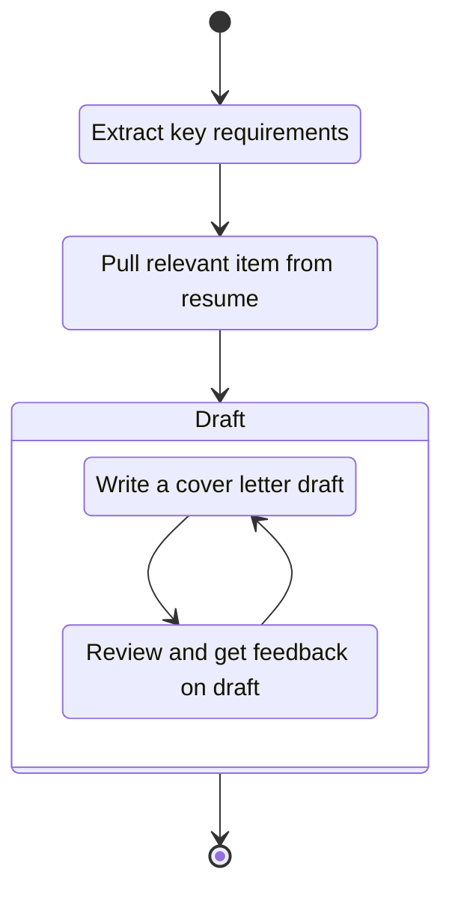

[](https://github.com/shippy/cover_letter_automation/actions)

# Cover Letter Automation

A Python package for ingesting job descriptions & resumes, and crafting cover letters that use the
latter to satisfy the former.

The process leverages GPT-4 to first extract relevant job description features, grabbing
corresponding features from the resume, and then looping between (1) generating a cover letter that
uses the resume to satisfy the job description and (2) critiquing the cover letter in question.
A state diagram follows:



## 🚀 Using

### With PyPi install

```bash
pip install cover_letter_automation
```

This should make `make-cover-letter` command available on your command line. You can then run the
following:

```bash
make-cover-letter path/to/json/resume.json path/to/jd.md
```

This will generate a cover letter for the job description in `path/to/jd.md` using the resume in 
`path/to/json/resume.json`. The full chat will be printed to the console, as will the estimated chat
cost.

Currently, due to the slightly ad-hoc nature of the agents, you'll need to run the above command for
each job description you want to generate a cover letter for. The cover letters will be placed in
`cover_letters/`, a folder which will be created for you in your current working direcroty.

See `make-cover-letter --help` for a full set of options.

### Set your API keys

You will need to add your OpenAI API key (and, optionally, Bing API key) to the environment as
`OPENAI_API_KEY` and `BING_API_KEY`, or pass them as CLI options.

You can [grab your Bing API key here](https://www.microsoft.com/en-us/bing/apis/bing-web-search-api), 
though do be warned that the volume of requests the agent will want to make possibly exceeds the free
tier. If you don't have a Bing API key, we'll automatically skip the web-search step.

**Note that `CompanyResearcher` is  mostly broken and doesn't work, so _not setting the `BING_API_KEY` is fine_**.


## Credits

<details>
<summary>️⚡️ Scaffolded with Copier.</summary>

See [Poetry Copier](https://github.com/lukin0110/poetry-copier/).

🛠️ [Open an issue](https://github.com/lukin0110/poetry-copier/issues/new) if you have any questions or suggestions.

See how to develop with [PyCharm or any other IDE](https://github.com/lukin0110/poetry-copier/tree/main/docs/ide.md).
</details>